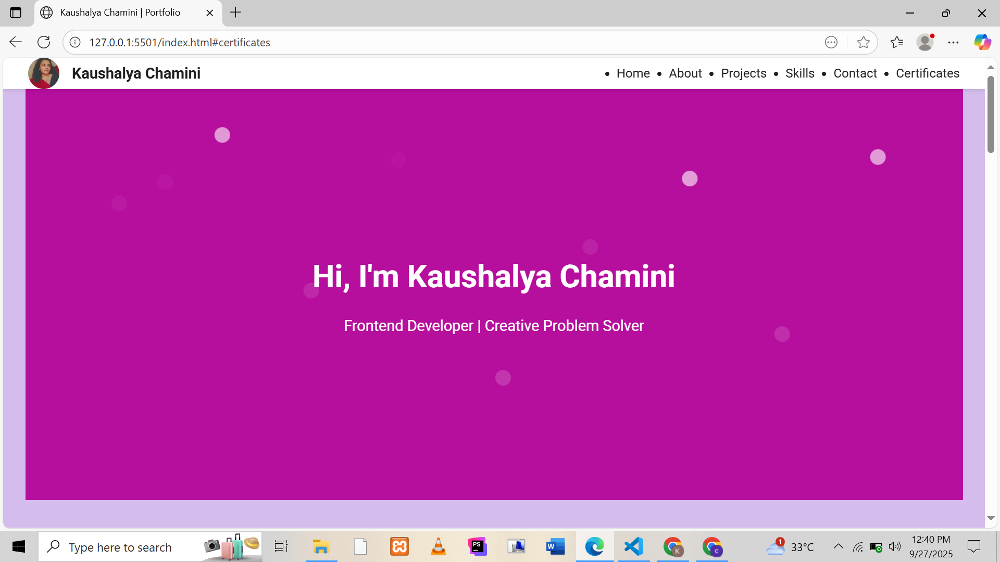
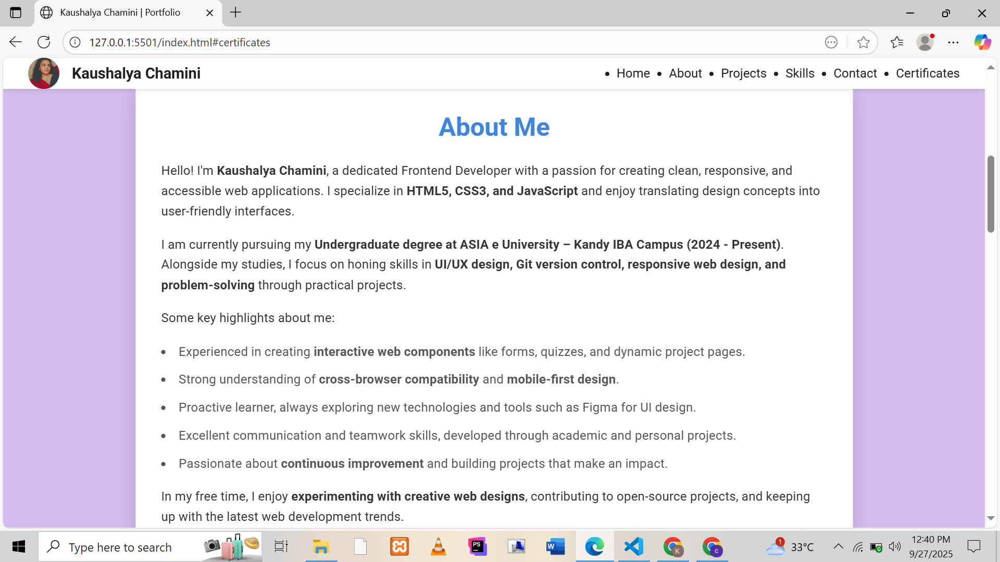
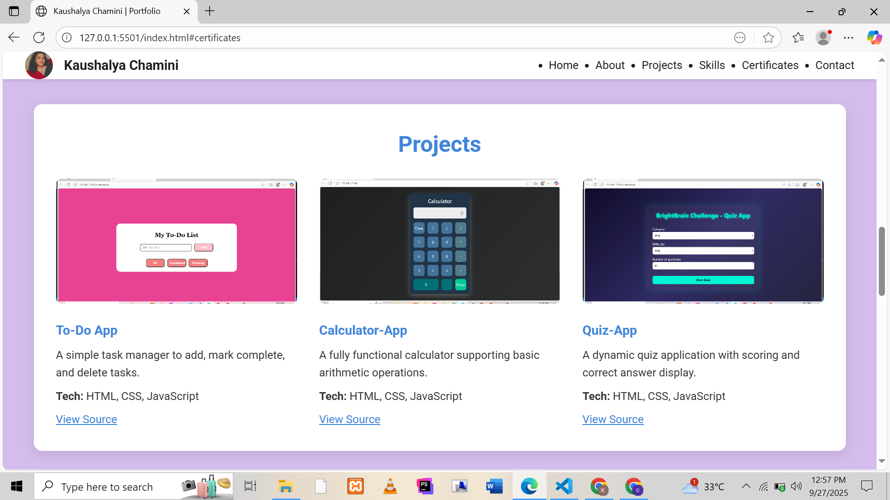
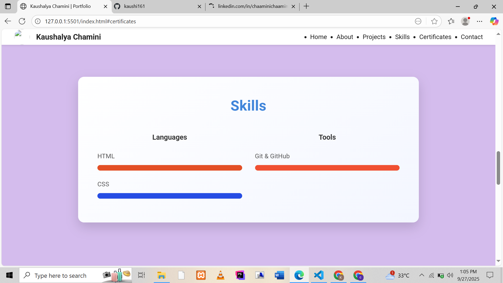
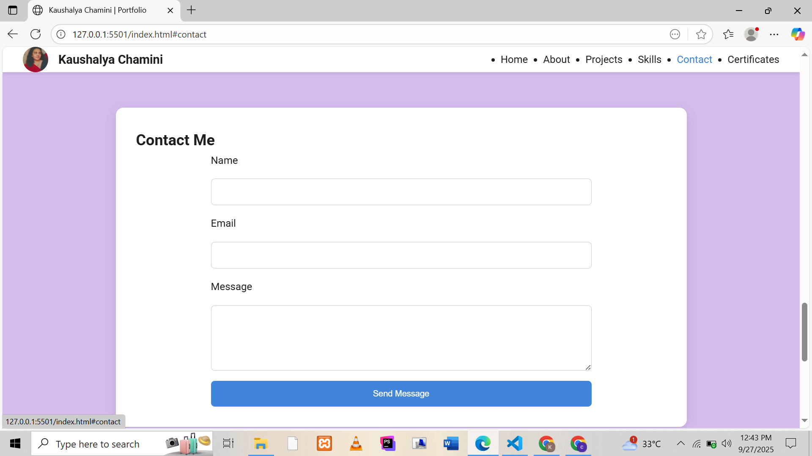
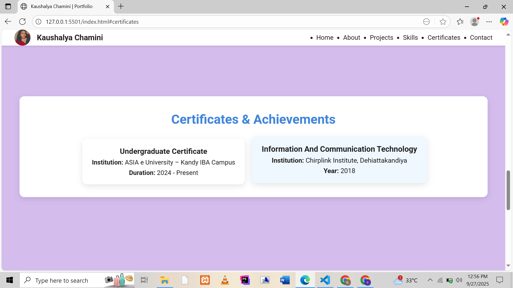

# Kaushalya Chamini | Personal Portfolio

**Enhanced Personal Portfolio (HTML5 + CSS3)**  
*Frontend Developer | Creative Problem Solver*

---

## **Project Overview**

This is my enhanced personal portfolio website, created as part of the Industrial Training Program.  
It is built using only **HTML5 and CSS3**, fully responsive, and accessible. The site showcases my projects, skills, education, achievements, and provides a way to contact me directly.

---

## **Features**

- **Hero Section**
  - Animated particle background (CSS only)
  - Introduction: Name, role, short tagline
  - Polished, centered layout

- **About Me**
  - Clean card layout
  - Education details
  - Highlights and skills
  - Key achievements listed in bullet points

- **Projects**
  - 3 fully documented projects
  - Each project includes:
    - Screenshot
    - Title & short description
    - Technologies used
    - GitHub source link

- **Skills**
  - Grouped by category: Languages & Tools
  - Visual CSS-only progress bars for proficiency

- **Contact**
  - Contact form with:
    - Name
    - Email
    - Message
  - Uses `mailto:` to send messages directly

- **Certificates & Achievements**
  - Undergraduate and ICT certificates
  - Clean card layout with hover effect

- **Footer**
  - Links to GitHub, LinkedIn, and Email
  - Copyright notice
  - Consistent across all pages

- **Design & Technical Highlights**
  - Fully responsive (mobile, tablet, desktop)
  - Semantic HTML5 structure
  - Accessible: skip link, focus outlines, alt text for images
  - Polished animations and hover effects
  - Google Font: Roboto
  - Color scheme: professional and visually appealing

---

## **Technologies Used**

- HTML5  
- CSS3 (Flexbox & Grid)  
- Google Fonts (Roboto)  
- CSS animations & transitions  
- Responsive design (media queries)  

---

## **Screenshots**

### Hero Section


### About Me


### Projects


### Skills


### Contact Form


### Certificates


---

## **Live Demo**

[Visit My Portfolio]( https://kaushi161.github.io/.github.io/)

---

## **How to Run Locally**

1. Clone this repository:  
   ```bash
   git clone https://github.com/username/personal-portfolio.git

2. Open index.html in
your browser.

personal-portfolio/
├── index.html
├── css/
│   └── style.css
├── assets/
│   └── images/
├── README.md

3. View all sections:

Hero

About

Projects

Skills

Contact

Certificates

## Author

Kaushalya Chamini
Frontend Developer | Creative Problem Solver

Email: weerasinghekaushalya09@gmail.com

GitHub: github.com/kaushi161

LinkedIn: linkedin.com/in/ChaaminiChaamini